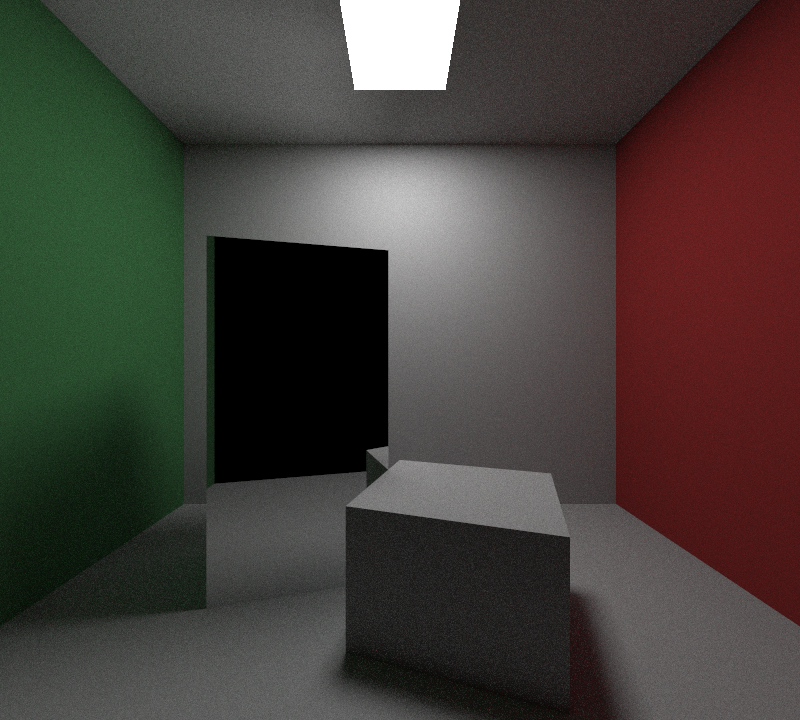

# tinyraytracer

这是一个用 C++ 实现的简易光线追踪渲染器，支持多种主流光线追踪算法和各种着色单元、模型、光源以及其他特性。


## Features

+ 算法: 实现了 Whitted-Style ray tracing, Monte Carlo path tracing algorithm, progressive photon mapping 等追踪算法 
+ 着色单元: 支持三角形、球、平面/四边形、长方体等多种着色单元
+ 模型: 支持obj文件模型读取和通过指定格式自定义模型
+ 光源: 点光源、方向光、区域光等多种光源模型
+ 加速结构: 采用 AABB包围盒 和 BVH 进行空间划分
+ 材质: 实现了 Diffuse, Metal, Dielectrics 等材质
+ 纹理: 实现了 Perlin Noise纹理、图片纹理映射
+ 其它特性: OpenMP多线程，软阴影，MSAA反走样，景深和动态模糊效果，烟雾效果

TODO:
+ Bezier 曲面模型
+ Bump Mapping
+ 微表面模型
+ Metropolis Light Transport 算法
+ 提高 Monte Carlo path tracing 算法的收敛速度
+ 优化 Progressive Photon Mapping 算法
+ SDF 模型
+ OpenGL 实现的 GUI
+ 更多的模型和场景

## Installation Instructions

### Prerequisites

- C++ compiler (gcc, g++, clang, etc.)
- CMake 3.12 or above
- OpenMP (optional)

### Build and Run the Program

1. Clone the project repository to your local machine using Git.
```
git clone https://github.com/liubf21/tinyraytracer.git
```

2. Navigate to the project directory.
```
cd tinyraytracer
```

3. Build the project using CMake.(May need to modify the CMakeLists.txt file to specify the path of OpenMP)
```
mkdir build
cd build
cmake ..
```

4. Compile the source code using Make.
```
make
```

5. Run the program.
```
./tinyraytracer 
```

## Usage

use -h or --help to get help information

## Examples


(more examples in output folder)

## References
[GAMES101](https://sites.cs.ucsb.edu/~lingqi/teaching/games101.html)

[smallpt](http://www.kevinbeason.com/smallpt/)

[tinyraytracer](https://github.com/ssloy/tinyraytracer/wiki)

[raytracing in one weekend](https://raytracing.github.io)

[minilight](https://www.hxa.name/minilight/)
